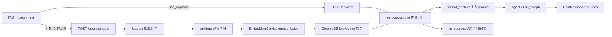
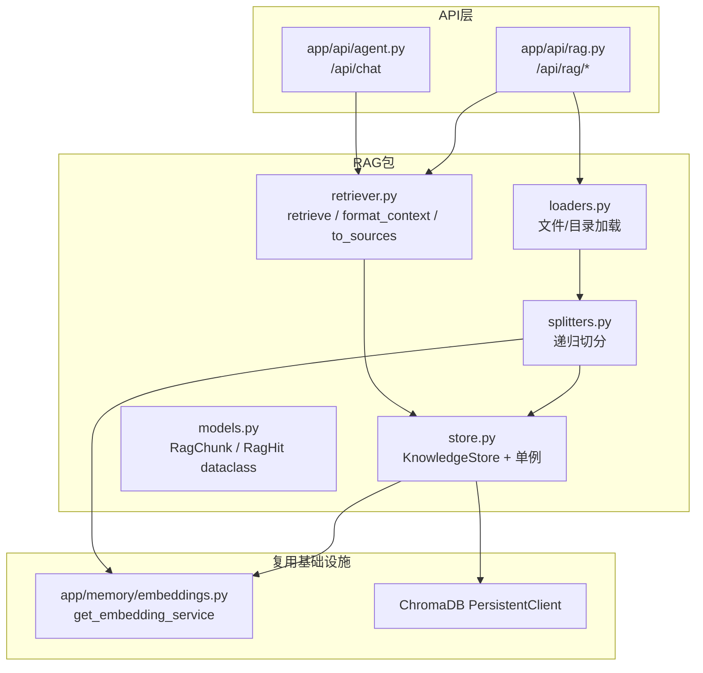

## 产品概述

在 JoyAgent 现有 FastAPI 服务上新增一套完整的 RAG 能力，使用户可以在前端页面上**自主开关 RAG**：开启时，后端自动从向量数据库（ChromaDB `knowledge` 集合）检索与问题相关的文档片段，注入到 LLM 上下文，并在响应中返回可展示的引用来源。

## 核心功能

1. **RAG 开关**：`/api/chat` 请求新增 `use_rag` 布尔开关（默认 `false`，完全向后兼容）。开启后端自动检索知识库；关闭则走原有链路，行为不变。
2. **文档入库链路**：新增 `/api/rag/ingest`，支持从前端上传文件（多选）与导入本地目录两种途径，自动完成「加载 → 切分 → embedding → 写入 knowledge 集合」。
3. **知识库管理**：新增 `/api/rag/collections`（查看集合与 chunk 数）、`/api/rag/search`（检索测试）、`/api/rag/documents`（列出已入库来源）、`DELETE /api/rag/documents`（按来源删除）、`/api/rag/health`（健康检查）。
4. **上下文注入 + 引用来源**：检索结果拼装为 Markdown 上下文注入 prompt（与现有 `retrieve_relevant_context()` 风格一致），同时响应体返回 `sources` 数组（来源文件名 / 相似度 / 片段文本 / chunk 序号），前端可折叠展示。
5. **前端面板**：在现有 `static/monitor.html` 上扩展 RAG 开关、文件上传/目录导入、检索测试、知识库状态与引用来源展示区。

## 边界与约束

- 不改变现有 `code` / `conversation` / `task` 三个记忆集合的语义空间，知识库独立成 `knowledge` 集合。
- 知识库切换能力**预留参数**（`rag_collection: str = "knowledge"`），但 UI 首期只暴露布尔开关，不做下拉选择。
- 不引入 LangChain / LlamaIndex，复用已有的 ChromaDB + sentence-transformers（本地离线模型 `models/all-MiniLM-L6-v2`）。
- PDF/DOCX 解析作为可选依赖（extras），不强制打入 Docker 镜像。

## 技术栈选型

沿用项目现有技术栈，零新架构风险：

| 用途 | 选型 | 现状 |
| --- | --- | --- |
| Web 框架 | FastAPI（`APIRouter(prefix="/api")`） | ✅ 已有 |
| 向量库 | ChromaDB `PersistentClient`，`hnsw:space=cosine` | ✅ 已有（`app/memory/long_term.py`） |
| Embedding | `sentence-transformers` 本地离线模型，384 维 | ✅ 已有（`app/memory/embeddings.py` + `models/all-MiniLM-L6-v2`） |
| 文本切分 | 自研递归切分器（Markdown 标题优先 + 字符窗口重叠） | ❌ 新建，不引入 langchain |
| 文档加载 | 自研 loader（文本类直接读；PDF/DOCX 走可选依赖） | ❌ 新建 |
| 前端 | 原生 HTML + 内联 CSS/JS（沿用 `static/monitor.html`） | ✅ 已有 |
| LLM | Anthropic SDK（DeepSeek 兼容端点） | ✅ 已有 |


**关键决策：不引入 langchain / llama_index。** 项目消息格式是 Anthropic 原生 dict（`{"role":"user","content":[...]}`），引入 LangChain 会带来 Message 类型转换负担与 5.8GB 镜像进一步膨胀。切分器和 loader 自研约 200 行，可控性更好。

**可选依赖走 extras**：`pyproject.toml` 增加 `[project.optional-dependencies] rag = ["pypdf>=4.2.0", "python-docx>=1.1.0"]`，未安装时 loader 抛出友好提示，不影响核心功能与 Docker 构建。

## 实现方案

### 整体策略

新建独立 `app/rag/` 包封装 RAG 全部能力（store / loaders / splitters / retriever），通过全局单例 `get_knowledge_store()` 暴露；API 层新增 `app/api/rag.py` 挂载到 `/api/rag/*`；对话层在 `app/api/agent.py` 的 `chat()` 中增加一条 `if request.use_rag:` 分支，检索后同时产出「注入上下文」和「sources 数组」。

### 核心流程



### 关键技术决策与权衡

1. **独立 `knowledge` 集合，而非扩展 `LongTermMemory.COLLECTIONS`**
现有 `COLLECTIONS = {"code","conversation","task"}` 是 Agent 记忆语义空间，混入外部文档会污染 `retrieve_relevant_context()` 的三路召回结果。新建 `KnowledgeStore` 持有独立 collection，命名前缀 `kb_`，互不干扰，且可单独 `reset_collection()` 而不影响记忆。

- ChromaDB 路径沿用 `CHROMA_PERSIST_DIR`（默认 `./data/chroma`）；`PersistentClient` 在相同 path + settings 下会复用缓存的 System 实例，不会产生 SQLite 锁冲突。

2. **CPU 密集型 embedding 必须脱离事件循环**
`EmbeddingService.embed/embed_batch` 是同步阻塞调用（sentence-transformers 推理）。入库可能上百个 chunk，直接调用会卡死整个 FastAPI 事件循环（包括 WebSocket 心跳）。必须用 `await asyncio.to_thread(self._emb.embed_batch, texts)` 包装。

- 注：现有 `LongTermMemory.store()` 是直接同步调用，属既有缺陷；RAG 模块不复制该问题，但不在本次改动其代码（控制影响半径）。

3. **切分策略**

- Markdown：按 `#`~`######` 标题先做结构切分，再对超长块做字符窗口切分（保留标题路径作为 metadata）。
- 代码文件：按空行/函数边界优先，退化到字符窗口。
- 默认 `chunk_size=800` 字符、`overlap=120` 字符（可通过配置调整）；单 chunk 超过 `MAX_TEXT_LENGTH=8192` 时强制再切（对齐 `EmbeddingService` 上限）。
- 每个 chunk 的 metadata 记录 `source`（相对路径/文件名）、`chunk_index`、`doc_id`、`ingested_at`。

4. **幂等入库 / 热更新**
chunk id = `sha256(doc_id + chunk_index + content)[:16]`；同一 `source` 重新入库时先 `collection.delete(where={"source": ...})` 再批量 `add`（先删后增，避免旧 chunk 残留）。文件内容哈希写入 `doc_hash` metadata，未变更时跳过重复 embedding（省算力）。

5. **检索与阈值**
`top_k` 默认 4；沿用项目既有 `similarity = 1 - distance/2` 换算与 `> 0.3` 相关性阈值，保持与 `retrieve_relevant_context()` 的行为一致，便于调优对比。注入上下文总长度用 `RAG_MAX_CONTEXT_CHARS`（默认 6000 字符）截断，避免挤占 LLM 上下文窗口。

6. **向后兼容**
`ChatRequest` 新增字段全部带默认值（`use_rag=False`、`rag_collection="knowledge"`、`rag_top_k=4`），`ChatResponse` 新增 `sources=[]`、`rag_enabled=False`。老的 curl / 前端调用行为完全不变。

### 性能与可靠性

- **批量 embedding**：`embed_batch()` 内部按 `MAX_BATCH_SIZE=256` 分片，且 `EmbeddingService` 自带 5000 条 LRU 缓存，重复文本零成本。
- **检索复杂度**：ChromaDB HNSW 近似检索，单次 query 约 O(log N)，top_k=4 时延毫秒级；每个请求额外 1 次 embedding（384 维，CPU 上约 5-15ms）。
- **失败降级**：检索异常（集合为空 / ChromaDB 不可用）时返回空上下文 + 空 sources，**不阻断对话**，仅打印一条 warning 日志，保证 RAG 是"增强"而非"依赖"。
- **并发**：`KnowledgeStore` 的写操作用 `threading.Lock`（对齐 `LongTermMemory._lock` 做法）保护 collection 操作。

## 实施注意事项（防回归）

1. **`main.py` 里 `Config` 未显式 import**（第 94 行靠间接导入）。新增 RAG 初始化代码时必须显式 `from app.core.config import Config`。
2. **`chat()` 的 Simple Agent 分支没有调用 `mm.end_session()`**（`app/api/agent.py:429-444`）。本次改造不要把 RAG 逻辑和这个缺陷耦合；如需修复单独提。
3. **WebSocket 推送**：`_active_connections` 是进程内内存字典，多 worker 下失效。RAG 事件沿用现有 `_broadcast_event()` 即可，不引入 Redis pub/sub（避免范围扩大）。
4. **前端 fire-and-forget 改造**：现有 `start()` 发完 `fetch` 不 await，拿不到 `sources`。改为先建 WS、再 `await fetch` 拿响应、渲染 sources，最后等 `workflow_end` 关闭连接。
5. **ChromaDB 持久化目录是相对路径**，依赖 CWD = `joyagent/`。入库的目录导入接口必须对传入路径做存在性与白名单校验，防止任意路径读取（安全）。
6. **Docker**：`ENV EMBEDDING_MODEL=/models/all-MiniLM-L6-v2` + `HF_HUB_OFFLINE=1`，本地已有模型，无需联网下载；不要往 Dockerfile 的 `pip install` 列表里加必装项。
7. **日志**：沿用项目 `print(f"  [xxx] ...")` 风格（如 `[long_term_memory]`），RAG 用 `[rag]` 前缀；不打印文档全文，只打印 source / chunk 数 / 耗时。

## 架构设计

### 模块关系



### 数据流（对话时）

`POST /api/chat {use_rag:true}` → `retriever.retrieve(message, collection, top_k)` → `[RagHit]` → 一路 `format_context()` 得到 Markdown 注入 `initial_state["messages"]`（workflow 分支）/ `context=`（simple 分支）；另一路 `to_sources()` 得到 `list[dict]` 塞进 `ChatResponse.sources` → 前端渲染。

### 数据流（入库时）

`POST /api/rag/ingest`（`UploadFile` 列表）或 `/api/rag/ingest/dir`（目录路径）→ loader 产出 `Document{source, content, doc_hash}` → splitter 产出 `RagChunk[]` → `asyncio.to_thread(embed_batch)` → `collection.delete(where={"source":...})` + `collection.add(...)` → 返回 `{files, chunks, skipped, elapsed_ms}`。

## 目录结构

```
joyagent/
├── app/
│   ├── rag/                          # [NEW] RAG 能力包（与 memory 平级，职责隔离）
│   │   ├── __init__.py               # [NEW] 导出 KnowledgeStore / get_knowledge_store / retrieve 等公共 API
│   │   ├── models.py                 # [NEW] RagChunk / RagDocument / RagHit dataclass；字段：id, source, content, chunk_index, score, metadata
│   │   ├── store.py                  # [NEW] KnowledgeStore：ChromaDB knowledge 集合的 CRUD；get_or_create_collection(hnsw:space=cosine)、add_chunks 批量写、delete_by_source、count、list_sources、reset、health_check；模块级单例 get_knowledge_store()
│   │   ├── loaders.py                # [NEW] DocumentLoader：load_file(path) / load_dir(root) / load_upload(bytes, filename)；复用 app/coding/repository_loader.py 的 gitignore 过滤 + 二进制检测思路；文本类直读，PDF/DOCX 走 try-import 可选依赖
│   │   ├── splitters.py              # [NEW] 递归切分器：Markdown 按标题结构切 → 代码按空行/def/class 边界切 → 退化到 chunk_size/overlap 字符窗口；产出带 chunk_index 与标题路径的 RagChunk
│   │   └── retriever.py              # [NEW] retrieve(query, collection, top_k) -> list[RagHit]（阈值过滤 + 排序）；format_context(hits) -> str（Markdown，供 prompt 注入）；to_sources(hits) -> list[dict]（供响应体返回）
│   ├── api/
│   │   ├── rag.py                    # [NEW] APIRouter(prefix="/api/rag", tags=["rag"])：ingest / ingest/dir / search / collections / documents / DELETE documents / health
│   │   └── agent.py                  # [MODIFY] ChatRequest 加 use_rag、rag_collection、rag_top_k；ChatResponse 加 sources、rag_enabled；chat() 加 RAG 检索分支并注入上下文；workflow() 同步支持
│   ├── core/
│   │   └── config.py                 # [MODIFY] 追加 RAG_* 类属性（沿用现有 os.getenv 类属性风格，不引入 pydantic-settings）
│   └── tools/                        # （本次不改，rag_search 工具留作后续扩展）
├── static/
│   └── monitor.html                  # [MODIFY] 新增 RAG 开关区、知识库上传/目录导入区、检索测试区、sources 折叠展示区；start() 改为 await fetch 以拿到 sources
├── main.py                           # [MODIFY] 显式 from app.core.config import Config；include_router(rag_router)；lifespan 中做 KnowledgeStore 预热与启动日志
├── .env.example                      # [MODIFY] 补充 RAG_* 与 CHROMA_PERSIST_DIR 示例
├── pyproject.toml                    # [MODIFY] 新增 [project.optional-dependencies] rag = ["pypdf>=4.2.0","python-docx>=1.1.0"]
└── tests/
    └── test_rag.py                   # [NEW] 切分器边界用例、入库幂等（重复入库不翻倍）、检索阈值过滤、chat 开关开关行为
```

## 关键代码结构

```python
# app/rag/models.py
@dataclass
class RagChunk:
    id: str              # sha256(doc_id + chunk_index + content)[:16]
    doc_id: str          # sha256(source + doc_hash)[:12]
    source: str          # 相对路径 / 上传文件名
    content: str
    chunk_index: int
    metadata: dict       # {doc_hash, heading_path, ext, ingested_at}

@dataclass
class RagHit:
    chunk: RagChunk
    score: float         # similarity = 1 - distance/2, 已 round(4)
```

```python
# app/rag/retriever.py — 三个纯函数式入口，供 API 层与对话层共用
async def retrieve(query: str, collection: str = "knowledge", top_k: int = 4,
                   score_threshold: float = 0.3) -> list[RagHit]: ...
def format_context(hits: list[RagHit], max_chars: int = 6000) -> str: ...
def to_sources(hits: list[RagHit]) -> list[dict]: ...
# 三者均保证：集合不存在 / 检索异常 → 返回空值，不抛异常上抛
```

```python
# app/core/config.py 追加（沿用现有类属性 + os.getenv 风格）
RAG_ENABLED          = os.getenv("RAG_ENABLED", "true").lower() == "true"
RAG_COLLECTION       = os.getenv("RAG_COLLECTION", "knowledge")
RAG_CHUNK_SIZE       = int(os.getenv("RAG_CHUNK_SIZE", "800"))
RAG_CHUNK_OVERLAP    = int(os.getenv("RAG_CHUNK_OVERLAP", "120"))
RAG_TOP_K            = int(os.getenv("RAG_TOP_K", "4"))
RAG_SCORE_THRESHOLD  = float(os.getenv("RAG_SCORE_THRESHOLD", "0.3"))
RAG_MAX_CONTEXT_CHARS= int(os.getenv("RAG_MAX_CONTEXT_CHARS", "6000"))
```

## 设计风格

沿用 `static/monitor.html` 现有的 **VS Code 暗色终端 / IDE 控制台** 风格（背景 `#1e1e1e`，正文 `#d4d4d4`，等宽字体），保持与 JoyAgent 开发者工具的调性一致。在此基础上把单栏日志页升级为「控制区 + 日志区 + 来源区」的三段式布局，加入卡片化面板、圆角、细边框与 hover 反馈，让页面从"调试页"提升为"可用控制台"。

## 页面结构（monitor.html，单页 5 个区块）

1. **顶部标题栏**：`JoyAgent Workflow Monitor` + 右侧 RAG 状态徽标（显示 `knowledge` 集合的文档数 / chunk 数 / 健康状态，每 30 秒或操作后刷新）。
2. **RAG 控制面板（卡片）**：左侧「启用 RAG」开关（checkbox + 自定义滑动样式，开启时主色高亮）；右侧两个入口 —— 文件上传（多选 `<input type="file" multiple>`，拖拽区域虚线边框 + hover 高亮）与目录路径输入框 + 「导入目录」按钮；下方一行操作反馈文案（成功绿色 / 失败红色）。
3. **检索测试区**：独立输入框 + 「检索测试」按钮，结果以列表卡片展示（来源名 / 相似度进度条 / 片段前 200 字），用于入库后验证召回效果。
4. **任务输入与进度日志区**：保留原有 `msg` 输入 + 发送按钮 + WebSocket 实时日志（`.start` 蓝 / `.done` 绿 / `.route` 黄 / `.end` 橙 / `.error` 红配色不变）；新增 RAG 命中事件的日志行（青色 `#4ec9b0`，显示 `RAG 命中 N 条`）。
5. **引用来源区（可折叠卡片）**：对话结束后展示 `sources`，每条为来源文件名 + 相似度徽章 + 折叠片段，点击展开；无命中时显示空态提示。

## 交互与动效

- 开关切换：150ms 平滑位移 + 主色渐变。
- 上传/导入/检索按钮：加载中显示内联 spinner 并禁用，完成后 2s 淡入结果提示。
- 日志追加：新行淡入（120ms），自动滚动到底部（沿用现有 `scrollTop` 逻辑）。
- sources 卡片：hover 抬升 2px + 边框高亮；展开/折叠用 `max-height` 过渡。
- 响应式：桌面双栏（控制面板与日志并排），窗口 < 900px 时堆叠为单栏。

## 可复用性

RAG 控制面板为独立 `<section>`，后续若新增 `static/rag.html` 可直接整段迁移；所有后端调用统一封装为 `apiPost(path, body)` / `apiUpload(files)` 两个函数，便于复用。

## Agent Extensions

### Skill

- **superpowers**
- Purpose: 为本次 RAG 集成提供规范化的开发流程（设计确认 → TDD → 代码审查 → 收尾），确保多文件改动有序推进
- Expected outcome: 每个模块先写测试用例再实现，改动完成后做一次自查式代码审查，避免遗漏回归点

### SubAgent

- **code-explorer**
- Purpose: 在修改 `ChatRequest` / `ChatResponse` 与 `chat()` 前，精确核查全仓库所有调用点、测试夹具与 `.env` / Dockerfile 引用，确认无遗漏
- Expected outcome: 输出完整的受影响调用点清单，确保向后兼容改动不破坏既有调用方